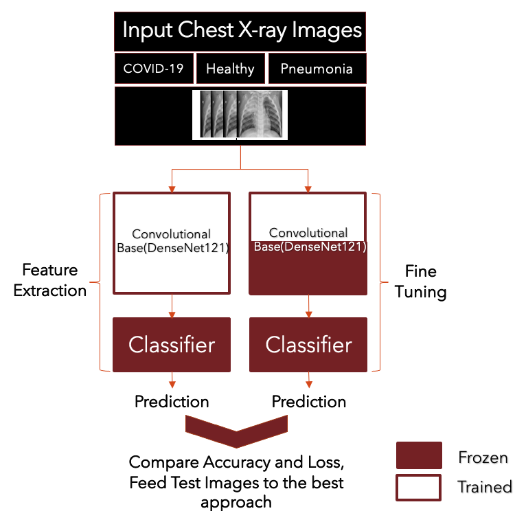
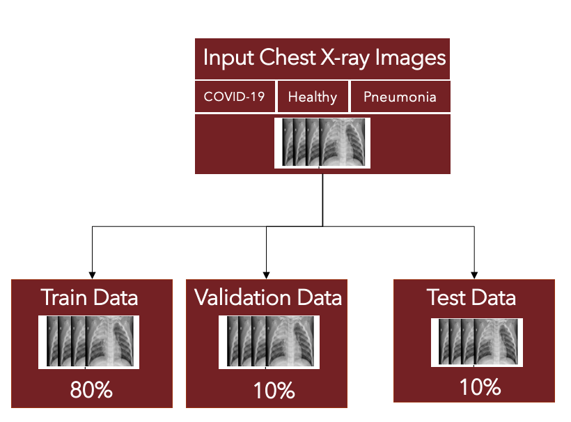
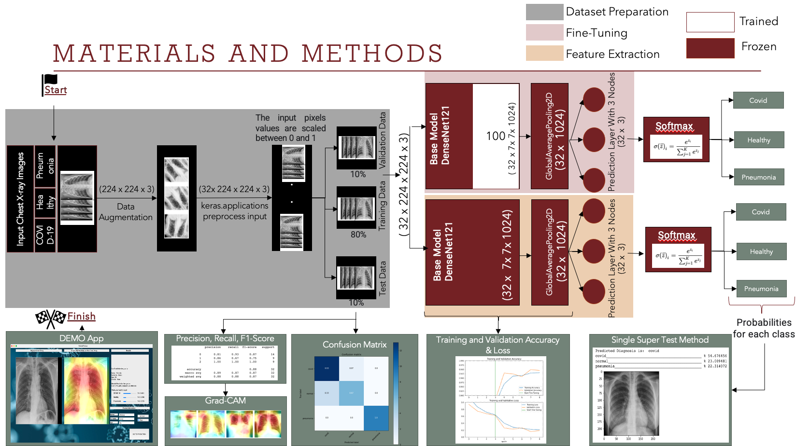
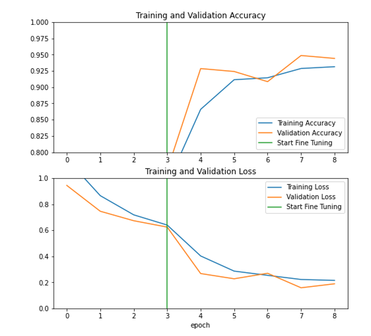
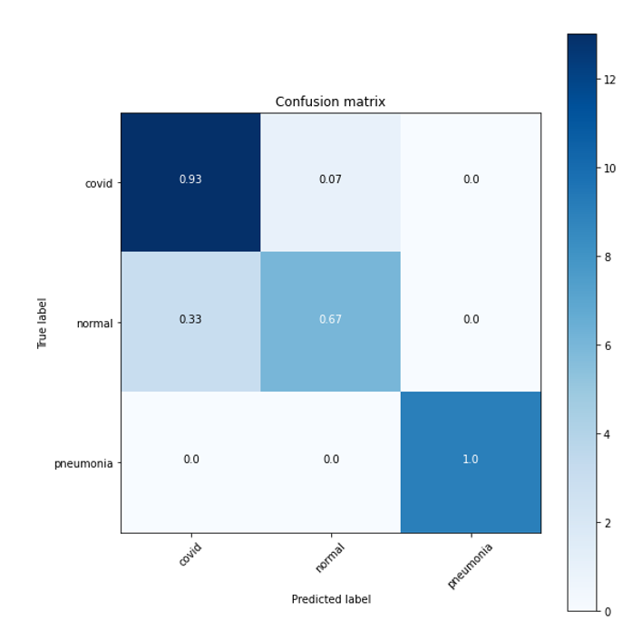
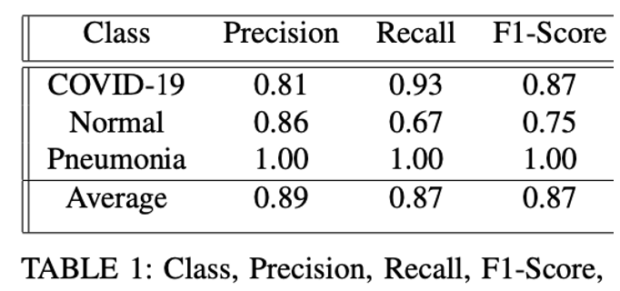
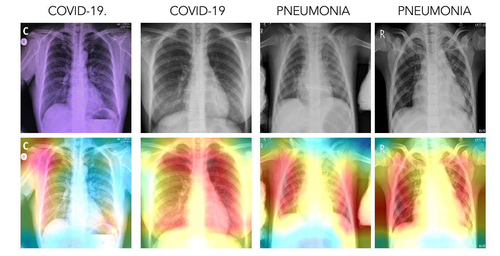

# Transfer_Learning_Covid-19_Pneumonia_Healthy

# Transfer Learning by Feature Extraction and Fine Tuning Approach

## Introduction

This study will provide a comparison between two ways of customizing a pre-trained model using transfer learning approach by fine-tuning and feature extraction, 
thus will show an effective way of using pre-trained models for classifying between COVID-19, Pneumonia, and Healthy images.   It is originality comes from this 
method comparison, in literature people tend to compare different pre-trained base models performance rather than methods.

Why I would like to research about the usage of pre-trained models is, at the beginning of this kind of pandemics, we would have no data, and collecting data may 
be hard, organizing this collection, creating a proper dataset is hard. We need a large-scale dataset in order to train complex neural network architectures, 
but if we don’t have a large enough dataset and we need to do something urgently to prevent COVID-19 from spreading, it is better to search ways of using, 
customizing pre-trained models.

## Dataset

The Dataset is called COVID19, Pneumonia and Normal Chest X-ray PA Dataset (Institution: Khulna University of Engineering and Technology)
The dataset is organized into 3 folders (covid, pneumonia , normal) chest X-ray images. Chest X-ray samples of COVID-19 were retrieved from different sources 
for the unavailability of a large specific dataset. The dataset consist of 1525 chest x-ray images per each class which sums up to 4575 in total. The dataset 
satisfies the great expectation of neural networks from the perspective of keeping balance in the dataset among different classes. Also, the dataset is important 
from the perspective of image properties, for example if you put small chest x-rays belong to children in healthy class and adult covid-19 patients which have 
larger chest x-rays in another class, then your model will develop a bias between small and large chest x-rays. So, we should be careful. I’ll talk about more on 
how I applied data augmentation and preprocessing on the next sections.Since COVID-19 and other pneumonia share some of these X-ray characteristics, it is not easy 
to differentiate the COVID-19 images from other pneumonia. 

###### Materials for storing data and coding can be listed as:

As a dataset, COVID19, Pneumonia and Normal Chest X-ray PA Dataset by the Khulna University of Engineering and Technology has been utilized. Download and store it in the Google Drive.
 For model building, testing and evaluation (coding), the Google Colab environment has been used. The libraries; Tensorflow, Numpy, Pandas, Matplotlib, Seaborn, Keras Image Data Generator, Keras Callbacks Model Check Point, Keras Applications Densenet121, OpenCV. 
In order to build Demo software desktop application PyQT5 Tools have been used.

## Materials and Methods

First thing I do after mounting my colab to the drive,  loading the images from directory and applying data augmentation. When we don't have a large image dataset, it's a good practice to artificially introduce sample diversity by applying random transformations to the training images, such as rotation and horizontal flipping. This helps expose the model to different aspects of the training data and reduce overfitting. 
There are two important points to be aware of in this case:
1) Configure the dataset for performance, the data augmentation will run on-device, synchronously with the rest of your layers, and benefit from GPU acceleration. 
(# Use buffered prefetching by tensorflow data library. )
When you export your model using model.save, the preprocessing layers will be saved along with the rest of your model. 
2) If you later deploy this model, it will automatically standardize images (according to the configuration of your layers). 
This can save you from the effort of having to reimplement that logic server-side
The  Densenet121 requires input pixel values to be scaled between 0 and 1 and each channel is normalized with respect to the ImageNet dataset.

Then we continue by dividing the dataset into three pieces, %80 percent Training, %10 Validation and %10 percent  Test set. 
Here, you see two different structures, orange one represents feature extraction and the pink one represents the fine-tuning approach of Transfer Learning. 
The purpose here is to, as I explained compare these two approaches in terms of performance. Let me introduce briefly these two structures. 
The intuition behind transfer learning for image classification is that if a model is trained on a large and general enough dataset, this model will effectively 
serve as a generic model of the visual world. You can then take advantage of these learned feature maps without having to start from scratch by training a 
large model on a large dataset.

### Feature Extraction: 
Use the representations learned by a previous network to extract meaningful features from new samples. You simply add a new classifier, 
which will be trained from scratch, on top of the pretrained model so that you can repurpose the feature maps learned previously for the dataset. 
In this step, you will freeze the convolutional base created from the previous step and to use as a feature extractor. Additionally, you add a classifier on 
top of it and train the top-level classifier. You do not need to (re)train the entire model. 

### Fine-Tuning: 
Unfreeze a few of the top layers of a frozen model base and jointly train both the newly-added classifier layers and the last layers of the base 
model. This allows us to "fine-tune" the higher-order feature representations in the base model in order to make them more relevant for the specific task. 
In the feature extraction experiment, you were only training a few layers on top of a base model. The weights of the pre-trained network were not updated during 
training. One way to increase performance even further is to train (or "fine-tune") the weights of the top layers of the pre-trained model alongside the training of 
the classifier you added. The training process will force the weights to be tuned from generic feature maps to features associated specifically with the dataset.

Also, you should try to fine-tune a small number of top layers rather than the whole base model. In most convolutional networks, the higher up a layer is, 
the more specialized it is. The first few layers learn very simple and generic features that generalize to almost all types of images. As you go higher up, 
the features are increasingly more specific to the dataset on which the model was trained. The goal of fine-tuning is to adapt these specialized features to 
work with the new dataset, rather than overwrite the generic learning.
So, in order to fine-tune I unfreeze the first 100 top layers of the pretrained model, unfreezing and retraining more layers would take more time for sure.

The Classification head, which consists of the GlobalAveragePooling2D layer, which generates predictions from the block of features, averaged over the spatial 
7x7 spatial locations and converts the features to a single 1024-element vector per image according to the structure we built. 
The composition of our model therefore structured as loading the pre-trained base model(and pre-trained weights), then in the next step stacking the classification
layers on top. In order to adjust a decision mechanism we also add a dense layer which consist of three nodes at the very end of the pre-trained network with the 
softmax activation function. Since we utilized the softmax activation function at the final dense layer, it is possible to get logits, and produce the probabilities belong to each class during the decision mechanism of our model. 

## RESULTS

Adam optimizer and the Sparse Categorical Cross Entropy as loss function have been used to compile the model. Fature Extraction after 4 epochs, the model achieved 
77.23% test accuracy. Then additional 4 epochs has been applied to train the model after fine- tuning approach adjustments, the model validation accuracy reached 
up to 94.42%. The evaluation metric of test accuracy is 94.58%. But Accuracy is not a good metric especially when there is  imbalance in the data. 
So, we should have a look at other metrics such as precision, recall and f1-score and confusion matrix.

I took a sub-patch from the test dataset and computed these values on it. According to the Confusion Matrix the model is good at detecting COVID- 19 cases and Pneumonia but on the other hand detecting or differentiating normal cases from other classes is harder according to this confusion matrix. 
So, you can see here the table which consist of Precision, Recall and F1-Score values. The model has difficulties identifying the actual healthy images, the proportion of correctly identified actual healthy chest x-rays (Recall) is smaller when compared to others.
Also, with the method that I wrote single super test method which you can see on my  code book. This method can take a path to any image and produces probabilities for each class belong to it.

Finally, the Grad-CAM technique has been used to visualize the regions of input that are ”essential” for predictions from these models or visual explanations using COVID-19 and Pneumonia chest X-ray. 

